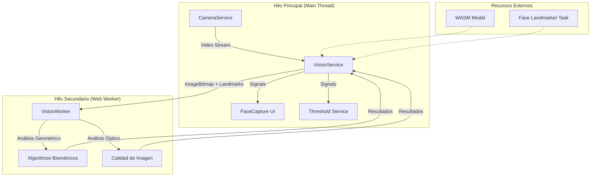
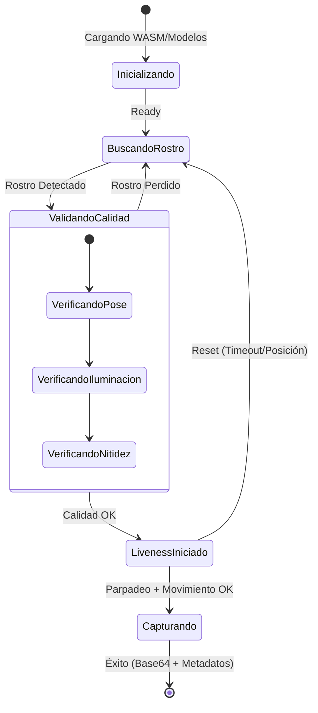

# Especificación Técnica: Sistema de Captura Biométrica (FACEDETEC)

## 1. Introducción
El proyecto **FACEDETEC** es un componente crítico del ecosistema **SIFv3** diseñado para el Onboarding Digital. Su objetivo principal es realizar la captura de rostro con validación de identidad en tiempo real, asegurando la presencia física del usuario (**Liveness Detection**) y mitigando ataques de suplantación (**Anti-spoofing**).

Este documento detalla la arquitectura técnica, el stack tecnológico y los algoritmos biométricos implementados para cumplir con los estándares de seguridad bancaria e **ISO/IEC 29794-5**.

---

## 2. Stack Tecnológico

El sistema ha sido construido priorizando el rendimiento y la seguridad directamente en el cliente (Browser-side), evitando el envío de streams de video al servidor y preservando la privacidad del usuario.

| Tecnología | Componente | Función |
| :--- | :--- | :--- |
| **Angular 21** | Framework Core | Gestión de estado reactivo mediante **Signals** y **Computed**. |
| **MediaPipe Tasks Vision** | Motor Biométrico | Detección de malla facial (478 puntos) con baja latencia. |
| **Web Workers** | Procesamiento | Ejecución de lógica matemática pesada en un hilo paralelo. |
| **WebAssembly (WASM)** | Modelo de Inferencia | Ejecución de modelos de visión artificial a velocidad nativa. |
| **GPU Delegate** | Aceleración | Uso de **WebGL** para la inferencia de modelos en tiempo real. |
| **GL Matrix** | Biblioteca Matemática | Operaciones vectoriales para pose cefálica y trigonometría 3D. |

---

## 3. Arquitectura del Sistema

La arquitectura sigue el patrón de **Offloading de Procesamiento** para garantizar que la interfaz de usuario no sufra bloqueos (jank) mientras se analiza el video a 30 FPS.

### Diagrama de Relación de Componentes

### Flujo de Datos (Zero-Copy)
Para optimizar el rendimiento, el sistema utiliza **ImageBitmap** y **Transferable Objects**. El frame de video capturado se convierte en un bitmap en el hilo principal y se transfiere al Worker sin duplicación de memoria, permitiendo un análisis de alta resolución con impacto mínimo en CPU.

---

## 4. Lógica Biométrica y Algoritmos

### 4.1 Liveness Detection Híbrida (Prueba de Vida)
El sistema combina señales pasivas y activas para confirmar que el sujeto es un ser humano vivo.

1.  **Parpadeo (EAR - Eye Aspect Ratio)**:
    - Se calcula la relación de aspecto de los párpados usando 12 puntos de referencia ocular.
    - Un valor por debajo del umbral `EAR_OPEN_THRESHOLD` (0.23) se registra como un evento de parpadeo.
2.  **Movimiento Cefálico (Yaw/Pitch)**:
    - Se mide la rotación en el eje vertical (Yaw) y horizontal (Pitch).
    - El usuario debe realizar movimientos leves para confirmar la tridimensionalidad del rostro.
3.  **Señal Vital (Micro-motion)**:
    - Análisis diferencial entre frames consecutivos (deltas de landmarks).
    - Un rostro vivo presenta micro-oscilaciones naturales de 0.0008–0.025 unidades; una foto es detectada por la ausencia de este movimiento.

### 4.2 Anti-Spoofing 3D (Prevención de Fraude)
Protección contra ataques de presentación (fotos impresas, pantallas digitales, máscaras).

- **Análisis de Profundidad Z**: MediaPipe proporciona coordenadas Z proyectadas. El sistema mide el rango de profundidad (punta de nariz vs. orejas). Si el rango es casi plano (< 0.12), el sistema infiere un ataque con fotografía.
- **Inercia Estática**: Si `staticFrames` supera el límite `MICRO_MOTION_STATIC_FRAMES`, el score de anti-spoof se penaliza a cero, bloqueando capturas de imágenes estáticas.

### 4.3 Métricas de Calidad ISO 29794-5
Se calcula un **Composite Quality Score (0-100)** basado en:

- **Nitidez (Blur)**: Varianza Laplaciana sobre la región de interés (ROI) del rostro.
- **Iluminación (Luma)**: Nivel medio de luminancia para evitar rostros oscuros o quemados.
- **Resolución Inter-ocular**: Garantiza que la distancia entre ojos en píxeles reales sea >= 90px.
- **Pose (Roll/Yaw/Pitch)**: Estricto control de inclinación lateral (Roll) para alineación biométrica.

---

## 5. Diagrama de Flujo de Captura

---

## 6. Configuración de Umbrales (Thresholds)

El sistema es dinámico y permite la calibración en tiempo real mediante el `ThresholdService`. Los valores base configurados para entornos de alta seguridad bancaria son:

| Constante | Valor Base | Descripción |
| :--- | :--- | :--- |
| `ANTI_SPOOF_THRESHOLD` | 0.70 | Mínimo para aprobar seguridad 3D. |
| `BLUR_THRESHOLD` | 60 | Nivel de nitidez mínima. |
| `MIN_INTER_OCULAR_PX` | 90 | Estándar ISO para reconocimiento. |
| `MAX_ROLL_DEGREES` | 12° | Inclinación lateral máxima permitida. |
| `SESSION_TIMEOUT_MS` | 120s | Tiempo límite de sesión para el usuario. |

---
**Documento generado por**: Antigravity AI Engineering.
**Versión**: 4.1 (SIFv3 Pipeline).
**Fecha**: Abril 2026.
